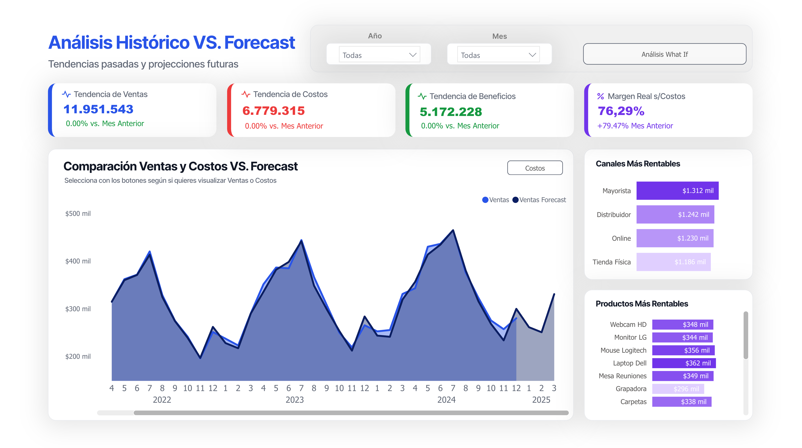

# Sales & Costs Forecasting with Prophet

## Overview

This repository contains a Python script that performs sales & costs forecasting using **Facebook Prophet**.  
The script takes a historical sales dataset, cleans and preprocesses the data, and generates forecasts for the next 90 days.  
It also evaluates model performance using common error metrics such as **MAE**, and **MAPE**.

### Workflow Summary
1. Load and inspect the raw dataset (`ventas_dataset_sucio.csv`).
2. Clean and format sales/costs and date columns to ensure proper data consistency.
3. Train a Prophet model to learn seasonal patterns and trends.
4. Generate 90-day sales predictions.
5. Evaluate forecast accuracy using standard performance metrics.

## Power BI Dashboard

An interactive Power BI dashboard has been built using the forecasted results from this model.  
You can explore the live dashboard here: [Power BI Dashboard Link](https://app.powerbi.com/your-dashboard-link)




## Notes

- The input dataset path (`Datos/ventas_dataset_sucio.csv`) should be updated if your data is stored elsewhere.
- Make sure Prophet is installed:  
  ```bash
  pip install prophet
